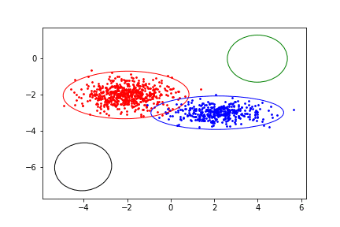

## Expectation-Maximization (EM) algorithm for Gaussian Mixture Models (GMM) 
##### Theory from: Pattern recognition and machine learning  Christopher M. Bishop

#### Implemented on dummy dataset, see notebook.

